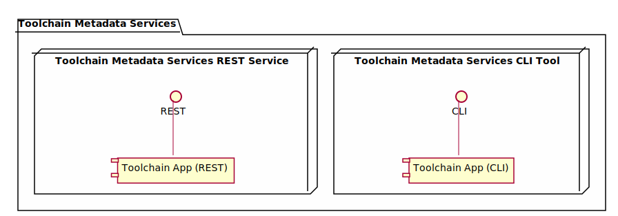
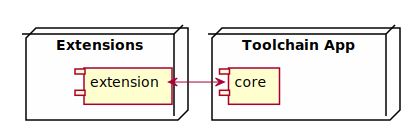
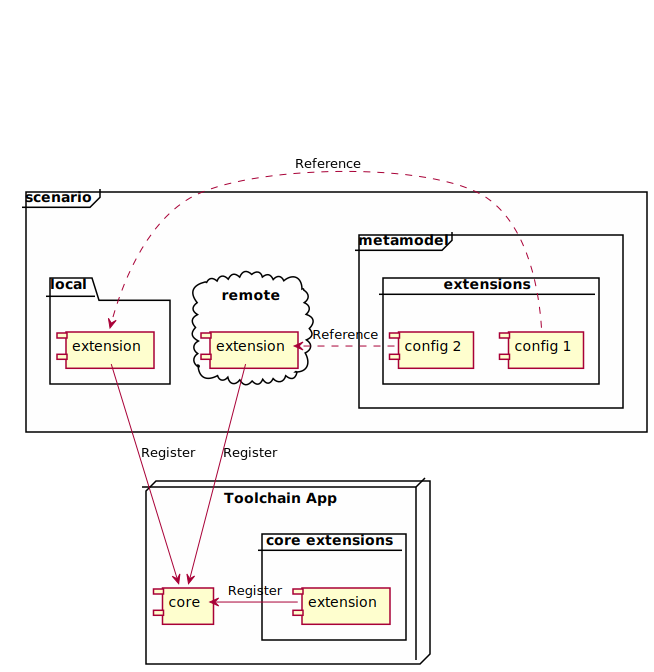
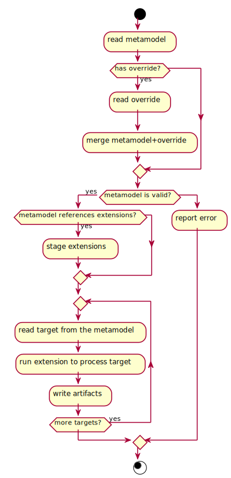

_Copyright (C) Microsoft Corporation_

# Design specification for Toolchain Metadata Services


## Table of Contents

<!-- toc -->
1. [Introduction](#introduction)
1. [Conceptual Model](#conceptual-model)
1. [Architecture](#architecture)
1. [Metamodel](#metamodel)
    1. [Toolchain Extensibility](#toolchain-extensibility)
    1. [Configuration Overrides](#configuration-overrides)
1. [Toolchain App Lifecycle](#toolchain-app-lifecycle)
1. [Extension Discovery](#extension-discovery)
    1. [Discovery and registration algorithm](#discovery-and-registration-algorithm)
    1. [Configuration file](#configuration-file)
    1. [Provider interface](#provider-interface)
        1. [Example](#example)
1. [Appendix](#appendix)
<!-- tocstop -->


## Introduction

Toolchain Metadata Services is a set of components that allows you to easily create, manage, and run templates for SDV development. You can extend capabilities of the Toolchain Metadata Services by adding custom commands or workflows to suit your specific needs.


## Conceptual Model

1. **Toolchain** - a set of systems, software, programming tools, or infrastructure that is used to perform actions of software lifecycle, e.g., build, deploy, run, or test a software product.
1. **Toolchain Metadata Services** - a set of components to model or configure a **Scenario** on the **Toolchain**.
    1. **Toolchain App** - the main application of the **Toolchain Metadata Services** that runs behind one of the following interfaces:
        1. **Toolchain Metadata Services CLI Tool** - a command-line interface to run the **Toolchain Metadata Services**.
        1. **Toolchain Metadata Services REST Service** - a RESTful service to run the **Toolchain Metadata Services**.
1. **Extension** (Toolchain Metadata Services Extension) - a pluggable software component of the **Toolchain Metadata Services**.
1. **Scenario** - a custom scenario for the **Toolchain**, e.g., build, deploy, run, or test a software product or a system. A **Scenario** is realized by a **Metamodel** and its **Extensions**.
    1. **Metamodel** - a configuration of the **Scenario**. For a specific **Scenario**, the **metamodel** is a way to build, deploy, run, test, or perform a specific action on a software product or a system. **Metamodel** can extend capabilities of the **Toolchain** by referencing **extensions** specific to a **scenario**.
        1. **Target** - a configuration of one **extension** inside the **metamodel**. A **target** describes how the **extension** will be used.


## Architecture

The main component of the **Toolchain Metadata Services** is the **Toolchain App**. At a high level, the relationship looks like the following:



There are two ways to run the **Toolchain App**:
1.  **REST Service**
1.  **CLI Tool**

At its core, **Toolchain App** consists of two main components: **core logic** and **extensions**.



One extension can interact with another through the core logic.

The core logic is responsible for loading extensions and running the targets defined in the metamodel. The extensions are responsible for implementing the business logic of the metamodel.

## Metamodel

The metamodel is a configuration that describes the business logic of a concrete scenario of the Toolchain. A target of the metamodel is a configuration of one component of the business logic. The business logic is implemented by the extensions.

### Toolchain Extensibility

A metamodel can extend the Toolchain App by referencing extensions. The Toolchain App discovers the extensions and makes them available to the metamodel. The metamodel uses the extensions to implement its business logic.

Below is a diagram of a scenario extending capabilities of the Toolchain through the metamodel:



`config 1` and `config 2` on the diagram above are sections of the metamodel configuration file that reference local or remote extensions. `extensions` is the parent section of `config 1` and `config 2`. The `extensions` section is used to reference and set up the extensions that the metamodel will use on top of the `core extensions` that are available by default. See the [Extension Discovery](#extension-discovery) documentation for more details.


### Configuration Overrides

A user can override a base metamodel to customize the behavior of the metamodel. The overrides are defined in a configuration file.

base metamodel
```yaml
config:
  key1: value1
  key2: 42
  key3:
    - value2
    - value3
```

configuration overrides
```yaml
config:
  key1: value4
  key3:
    - value5
```

resulting configuration
```yaml
config:
  key1: value4
  key2: 42
  key3:
    - value5
```

The user can override only those keys that are defined in the base metamodel. The user cannot add new keys to the configuration. The type of the value must match the type of the value in the base metamodel.

For a concrete example of a metamodel configuration overrides, see [VECU - Overriding Configuration](../../../../scenarios/vecu_builder_guide/README.md#overriding-configuration).


## Toolchain App Lifecycle

The Toolchain App lifecycle is shown below:



A _target_ of a _metamodel_ declares what _extension_ it will use and how that _extension_ will be configured.

In essence, the Toolchain App executes the business logic of the metamodel by running the targets of the metamodel and writes the artifacts produced during the execution.


## Extension Discovery

A metamodel can reference the extensions it uses in its configuration file. The Toolchain App then discovers the referenced extensions through the Provider interface.

The Provider interface is an abstraction that enables the introduction of custom implementations for discovering Toolchain App extensions. The interface is defined in the Toolchain App project. A metamodel can reference one or more specific providers that implement the Provider interface. The Toolchain App will use these providers to discover extensions.

### Discovery and registration algorithm

The algorithm to discover and register extensions is as follows, where (C) is core logic and (P) is provider logic:

1. (C) Load and register all extensions that are part of the Toolchain App. Those extensions are always available. They are located in the [toolchain/src/extension](../../src/extension) directory.
1. (C) Load the configuration file.
1. (C) For each extension provider in the `extensions.providers` section of the configuration file:
    1. (C) Initialize an instance of the provider.
    1. (C) Call the provider to stage extensions - `ExtensionProvider.stage_extensions(source_location, destination)`.
        1. (P) The provider should be able to get the extension from the `source_location` and make it available at the `destination`.
    1. (C) Register the extensions with the Toolchain App. The Toolchain App will load all extensions from the `destination` directory and make them available to the metamodel.
1. (C) After all extensions have been loaded and registered, validate extensions and dependencies. Details are in the [Toolchain Metadata Services - Extensions Dependencies](../extension.md#extensions-dependencies) section.
1. (C) Run the `targets` section of the metamodel. The `targets` section describes the business logic of the metamodel. See [VECU - Targets](../../../../scenarios/vecu_builder_guide/README.md#targets) for details and example.


### Configuration File

Example of the `extensions` section in a configuration YAML file:

```yaml
config:
    ...

extensions:
  providers:
    - provider: local filesystem
      location: /home/user/metamodel/extension/github_dispatch_workflow
      # Re-use the location as the staging directory.
      staging_directory: /home/user/metamodel/extension/github_dispatch_workflow

    - provider: local filesystem
      location: /tmp/mock
      # Copy the extension to a different location.
      staging_directory: /home/user/metamodel/extension/mock

    - provider: http
      location: http://domain.com/my_extension/
      # Download the extension to this location.
      staging_directory: /home/user/metamodel/extension/my_extension

targets:
    ...
```

**Note:** `config` and `targets` sections are shown in the example for completeness and reference only, the details of these section are omitted intentionally. Current implementation can be found in the VECU builder scenario configuration file: [vecu.yaml](../../../../scenarios/vecu_builder_guide/vecu.yaml).


### Provider Interface

Below is a summary of the provider interface. For details, see the [source code](../../src/core/extension_provider/__init__.py).

```python
class ExtensionProvider:
    @property
    def provider_type() -> str:
        """A unique name of the provider."""

    def stage_extensions(source_location: str, destination: str) -> None:
        """
        Stages one or more extensions from the `source_location` to the `destination`.

        `source_location` is an implementation-specific location of the extension.
        `destination` is a directory on a local file system where the extension will be staged to.

        Example:
        -------
        1. On a local file system `source_location` is a path to the extension
           and `destination` can be the same, which could result in a no-op
           implementation of this function for a local file system provider.
        2. For an HTTP provider `source_location` is a URL to the location where the extension can be downloaded from.

        Notes:
        -----
        1. `destination` is a directory, not a file, because there may be content to accompany extensions.
           Every extension must implement the `BaseExtension` class.
        2. The Toolchain App must have read-write permissions to the `destination` directory.
        """
```

#### Example

For an example of an extension that can be staged by an implementation of the `ExtensionProvider`, see [BaseExtension](../../src/extension/__init__.py), or [MockDeployLocal](../../src/extension/metamodel/mock/deploy_local/mock_deploy_local.py).


## Appendix

1. [General information about the Toolchain Metadata Services](../README.md) - general documentation about the Toolchain Metadata Services, including design specification, user and developer guides.
1. [vECU Builder Guide](../../../../scenarios/vecu_builder_guide/README.md) - a concrete scenario for the Toolchain, including the metamodel and extensions. Contains detailed documentation and explanation of different parts of the metamodel.
1. Microsoft Documentation: [Software-defined vehicle DevOps toolchain](https://learn.microsoft.com/en-us/azure/architecture/industries/automotive/software-defined-vehicle-reference-architecture).
1. ADR: [Extension Discovery in Toolchain Metadata Services](../../../doc/adr/toolchain-metadata-services-extensions-discovery/README.md) - an architectural decision record for the extension discovery algorithm.
