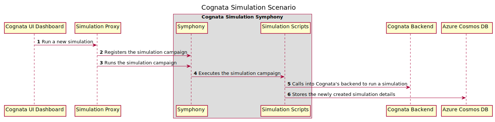

_Copyright (C) Microsoft Corporation_

# Toolchain Scenario: Running a Vehicle Simulation Dashboard Website

## Table of Contents

1. [Summary](#summary)
1. [Diagram](#diagram)
1. [Config](#config)
1. [Extensions](#extensions)
1. [Targets](#targets)
1. [Dependencies](#dependencies)
1. [How to run](#how-to-run)

## Summary

In this simulation scenario, you will be deploying a dashboard website that displays data from vehicle simulations. When a new simulation is initiated, the simulation will run on [Cognata's](https://www.cognata.com/) backend service.

The [cognata_simulation.yaml](./cognata_simulation.yaml) metamodel file describes the environment of a simulation. There are three main entries in the file:

1. [config](#config): the simulation and UI definition configuration.
1. [extensions](#extensions): additional extensions that are used to build and run a simulation.
1. [targets](#targets): list of simulation targets and metadata that are used to run a Cognata simulation.

## Diagram

The following time sequence diagram depicts the end-to-end simulation scenario.



The sequence shown in the diagram:

1. The user of the dashboard clicks on the `Create job` button to run a new simulation.

1. The dashboard notifies the Simulation Proxy to start a new simulation.

1. The Simulation Proxy registers the simulation campaign with Symphony.

1. The Simulation Proxy tells Symphony to run the simulation campaign.

1. Symphony executes the simulation campaign by calling the scripts needed for the simulation.

1. One of the scripts executed by Symphony calls into Cognata's backend service to run the actual simulation.

1. Once the simulation is completed, the details of the simulation are stored into your Cosmos Azure database.

To see the steps in the simulation Symphony campaign, please view the [simulation campaign](./include/cognata_simulation_symphony_campaign.json.j2) file. For information about Symphony and how Symphony campaigns work, refer to the [Symphony workflows](https://github.com/eclipse-symphony/symphony/blob/main/docs/symphony-book/concepts/workflows.md) documentation.

## Config

This entry describes the general configuration of the [simulation metamodel](./cognata_simulation.yaml). A [target](#targets) may reference any entry from `config`. An entry may have an arbitrary name, but it must be unique.

### `simulation`

This entry contains general information about the simulation metamodel. The entries below `simulation` are examples of requirements and conditions needed by Cognata's simulation service.

```yaml
  simulation:
    # requirements to run the simulation
    environment: SimCloud
    test_plan_sku: EURONCAP
    steps:
    - "create_project"
    - "requirements"
    - "scenario_details"
    - "launch_plan"
    - "query_plan"
    start_step: create_project
```

### `application`

This entry describes the network configuration of each application needed to run the end-to-end simulation scenario.

```yaml
  application:
    # Specify the authority and port of each application.
    cognata_simulation_proxy:
      alias: simulationproxy
      host_authority: 0.0.0.0
      port: 4343
    cognata_simulation_symphony:
      alias: simulationsymphony
      host_authority: simulationsymphony
      port: 8082
    cognata_ui_dashboard:
      alias: simulationui
      host_authority: localhost
      port: 3000
    cognata_ui_dashboard_backend:
      alias: simulationuibackend
      host_authority: localhost
      port: 5000
```

### `virtual_environment`

This entry requires Cognata and Azure specific configuration to authenticate and run a simulation.

```yaml
  virtual_environment:
    # Cognata specific configuration
    studio_url: <COGNATA_STUDIO_URL>
    username: <COGNATA_BACKEND_USERNAME>
    password: <COGNATA_BACKEND_PASSWORD>
    database_id: toolchain
    jobs_container: jobs
    users_container: users
    projects_container: projects
    jwt_secret: supersecret
    environment: DEVELOPMENT
    # Azure specific configuration
    azure_cosmos_db_primary_key: <AZURE_COSMOS_DB_PRIMARY_KEY>
    azure_cosmos_db_uri: <AZURE_COSMOS_DB_URI>
```

### `notification`

This entry specifies the configuration for email notifications that are sent upon the completion of a simulation.

```yaml
  notification:
    keyvault_name: <KEYVAULT_NAME>
    keyvault_key: <KEYVAULT_KEY>
    # The notification configuration
    # The notification will be sent to the specified email address
    email:
      sender: <some@domain.zone>
      recepients:
        - johndoe@hotmail.com
        - alice@hotmail.com
```
### `symphony`

This entry specifies Symphony as the execution engine for building and running simulations.

The `base_url` field is used for DNS aliasing in a user-defined bridged Docker network. The value of this field should be the name of the container.

```yaml
  symphony:
    # Home directory for Symphony files that are generated by the toolchain from this metamodel
    # Example:
    # toolchain_output_path: /home/toolchain-environment/toolchain-demo
    toolchain_output_path: <TOOLCHAIN_OUTPUT_PATH>
    base_url: http://simulationsymphony:8082/v1alpha2
```

## Extensions

This entry tells Toolchain Metadata Services how to discover extensions that are used to build and run the vECU. An extension is a logical unit of work in the Toolchain Metadata Services. See [toolchain extension](../../platform/toolchain/doc/extension.md) for more information about extensions.

```yaml
extensions:
  providers:
    - provider: local filesystem
      location: ../common/extensions/
      staging_directory: ../common/extensions/
    - provider: local filesystem
      location: ./toolchain/extension
      staging_directory: ./toolchain/extension
```

For details about the extensions discovery mechanics, see [the design specification for Toolchain Metadata Services CLI Tool](../../platform/toolchain/doc/design/README.md#extension-discovery).

## Targets

This entry is the same as described in the [vECU builder guide scenario](../vecu_builder_guide/README.md#targets), except the targets in this simulation scenario describe the targets that are used to start the simulation UI dashboard and run a simulation on Cognata.

For details of targets in this scenario, please view the [cognata_simulation_targets.yaml.j2](./include/cognata_simulation_targets.yaml.j2) file.

### Simulation Targets

The details of the target file for this scenario are specified in [cognata_simulation_targets.yaml.j2](./include/cognata_simulation_targets.yaml.j2).

`cognata_simulation_symphony_campaign`: Configures the Symphony campaign for running a simulation.

`notification_email`: Configures the functionality to send an email notification once a simulation is completed.

`cognata_simulation_scripts`: Configures the simulation scripts required by Symphony to run the simulation campaign.

`cognata_simulation_proxy`: Configures the proxy that calls into Symphony to register the simulation campaign and activate it.

`cognata_ui_dashboard`: Configures the simulation UI dashboard.

## Dependencies

The [cognata_simulation.yaml](./cognata_simulation.yaml) metamodel depends on the following other components:

- [Symphony](https://github.com/eclipse-symphony/symphony). Symphony is used to orchestrate the steps to build and run the simulation scenario.

- Azure Cosmos Database resource configured in your Azure subscription. Your Azure Cosmos Database resource should consist of three containers: `users`, `jobs`, and `projects`. The `users` container will need to be pre-populated with a user, which is an item entry that has a username and password. The password should not be stored as plain text. The password should be hashed at rest using the `bcrypt` algorithm when you store it in your `users` container.

- User credentials for Cognata's backend. To create a simulation job, you will need access to Cognata's backend.

- [Python 3.10](https://www.python.org/downloads/release/python-3100/). Cognata's Python API library requires Python 3.10.

## How to run

Toolchain Metadata Services and Symphony can run locally or remotely in the Cloud. The easiest way to run this scenario is with a dev box. Your dev box will act as the Toolchain VM. Inside the Toolchain VM, we will run the simulation scenario in a containerized environment with Docker as the container runtime.

Steps:

1. Create a dev box per [Microsoft Dev Box](../../platform/doc/guidance/microsoft-dev-box.md) documentation. The dev box will contain everything needed to run the Toolchain, including Windows 11 Enterprise, WSL2, Docker, VSCode, Toolchain Metadata Services, and Symphony.

1. Log into the dev box. The following steps should run inside your dev box.

1. Update the [cognata_simulation.yaml](./cognata_simulation.yaml) simulation metamodel with your definition and configuration. Replace all the `<PLACEHOLDER>` values with your values in the `cognata_simulation.yaml` file.

1. Execute the `cognata_simulation.yaml` metamodel (with optional overrides). See [Execute Metamodel](../../platform/toolchain/doc/toolchain-metadata-services.md#execute-metamodel) for details.

1. Copy the output directories and files to the location that is defined in the `config.symphony.toolchain_output_path` field of your `cognata_simulation.yaml` metamodel.

1. Add the executable flag to the copied `.sh` files. Make sure to replace `<OUTPUT>` with the location that you defined in `config.symphony.toolchain_output_path`.

    ```bash
    find <OUTPUT> -name '*.sh' -exec chmod +x '{}' \;
    ```

1. Navigate to the path defined in `config.symphony.toolchain_output_path`, then run the container deployment `./cognata_ui_dashboard_deploy/container_deploy.sh` script to start up the scenario. This will create a user-defined bridge network called `simulation` and start up the following containers: `simulationsymphony`, `simulationproxy`, `simulationui`, and `simulationuibackend`.

1. In your web browser, visit `http://localhost:3000` to see the simulation dashboard website.
