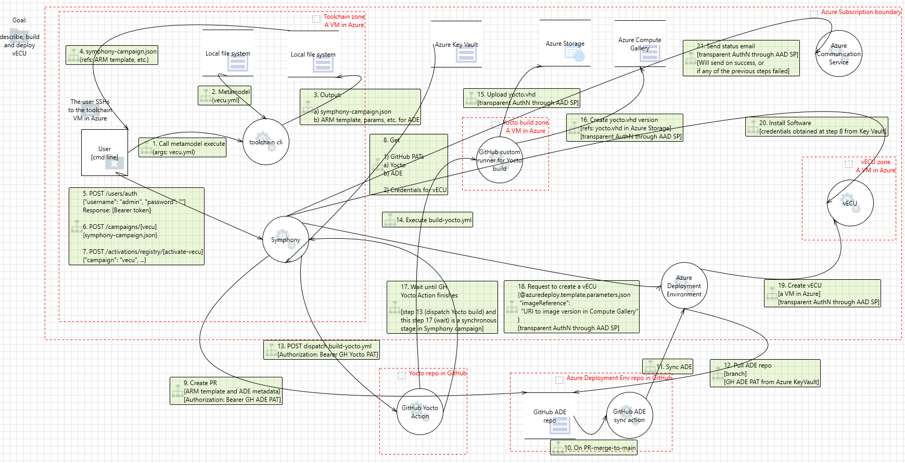
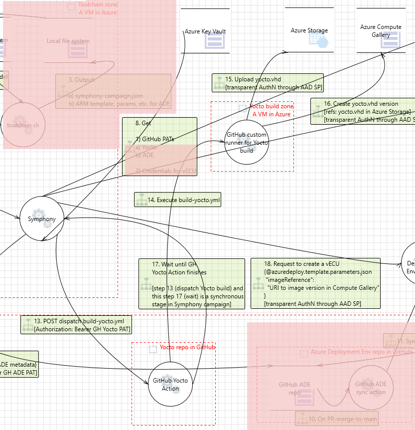
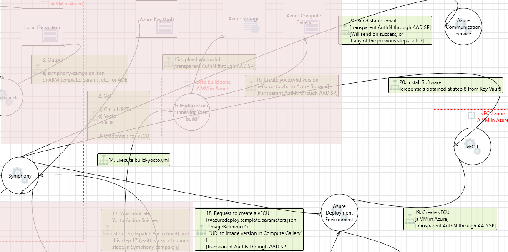
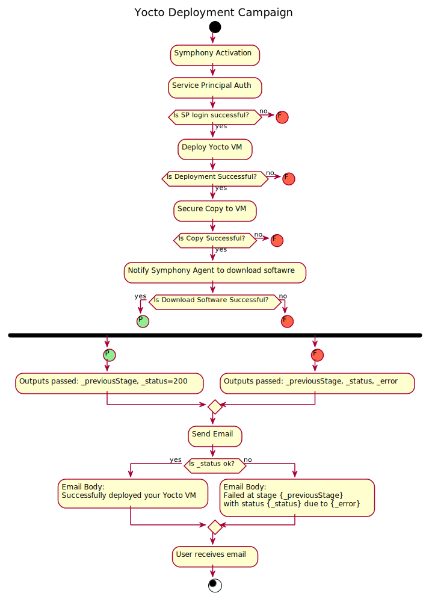
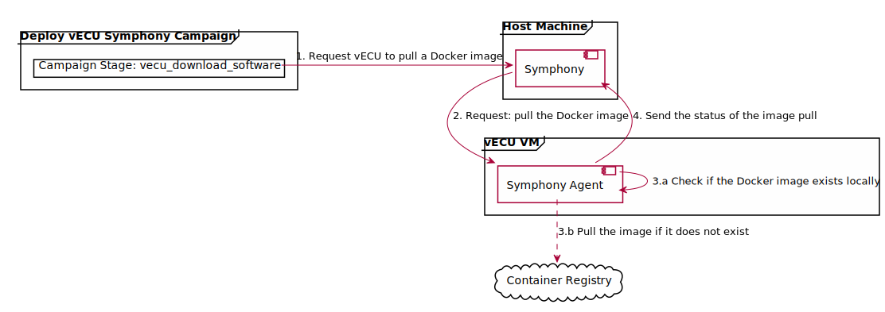

_Copyright (C) Microsoft Corporation_

# Toolchain Scenario: Virtual ECU Builder

- [Summary](#summary)
- [End-to-End Scenario](#end-to-end-scenario)
  - [First campaign: Dispatch workflow](#first-campaign-build-yocto-os)
  - [Second campaign: Deploy vECU](#second-campaign-deploy-vecu)
- [Metamodel](#metamodel)
  - [Config](#config)
  - [Extensions](#extensions)
  - [Targets](#targets)
- [Dependencies](#dependencies)
- [How to Run](#how-to-run)
- [Overriding Configuration](#overriding-configuration)

## Summary

This directory demonstrates an end-to-end scenario where a Yocto OS image is built and then deployed onto a new vECU (Virtual Electronic Control Unit).

This multi-stage workflow is orchestrated by Symphony campaigns. When one stage finishes, Symphony runs a selector that selects the next stage. When no new stages are selected, the campaign finishes. See [Symphony workflows documentation](https://github.com/eclipse-symphony/symphony/blob/main/docs/symphony-book/concepts/workflows.md) for more details. The campaigns in this scenario use Symphony's Stage Script Provider to orchestrate the running of multiple custom scripts.

This scenario can be run directly from your devcontainer.

## End-to-End Scenario

The following diagram depicts the end-to-end scenario:



For simplicity, readability, and easy testing, this scenario is split up into two campaigns.

### First campaign: Build Yocto OS

The first campaign:
1. Dispatches a GitHub workflow that builds the Yocto image and uploads the image to Azure Compute Gallery.
1. Waits for the workflow run to complete.
1. Returns an error code if the workflow fails or a success code if the workflow succeeds
    > Note: In the current implementation, the campaign also returns a success code if the workflow is cancelled.



### Second campaign: Deploy vECU

The second campaign:
1. Deploys a vECU VM based on the image built in the first campaign (and deploys all necessary networking resources) using Azure Deployment Environments (ADE).
1. Downloads a text file onto the vECU.
    > This is to simulate downloading an essential resource, such as a software package, a container, etc.
1. Notifies the Symphony Agent on the vECU to retrieve the public [hello-world](https://hub.docker.com/_/hello-world/) docker image. See [Retrieving the Docker image](#retrieving-the-docker-image) for a detailed explanation.
1. Notifies the user via an email.



> **Note: This example is not suitable for use in production.** Read the following guidance if you are adapting this example for a production scenario:
> - In this implementation, the VM password is passed in plain text when copying the text file to the vECU VM. For better security in production, use authentication with an [identity file](https://www.ssh.com/academy/ssh/identity-key).
> - Avoid setting `StrictHostKeyChecking=no` in your client command line. Instead, set up [authorized keys](https://www.ssh.com/academy/ssh/authorized-keys-openssh) to reference CIDR blocks where you can specify an allowed subnet.
> - Review the [sshd_config (the server-side config)](https://www.man7.org/linux/man-pages/man5/sshd_config.5.html) and configure the desired level of security for your vECU. For example, password authentication can be disabled altogether in that file and clients would not be able to ssh with a username/password.

The final stage of the campaign sends an email to the user about the status of the campaign upon completion. If any stage of the campaign encounters an issue, the email will specify which stage failed and the campaign will stop running:



#### Retrieving the Docker image

The diagram below illustrates the steps to retrieve the hello public docker image:



**Prerequisite Symphony knowledge:** A [Symphony Agent](https://github.com/eclipse-symphony/symphony/blob/main/docs/symphony-book/agent/target-agent.md) runs on a [Symphony Target](https://github.com/eclipse-symphony/symphony/blob/main/docs/symphony-book/concepts/unified-object-model/target.md). The Agent receives requests from Symphony and performs [Symphony's state seeking mechanism](https://github.com/eclipse-symphony/symphony/blob/main/docs/symphony-book/concepts/state_seeking.md) to ensure that the Target reaches the desired states defined by the requests.

In this scenario, the vECU is the Target. Symphony sends a request to the Symphony Agent. The request is to retrieve a Docker image. The Agent running on the vECU receives the request, and then checks the current state of the vECU to see if the Docker image already exists locally. If the image does not exist, then the Agent downloads the image to satisfy the desired state.

When the request is satisfied, the Agent sends a response back to Symphony.

The Symphony Agent's port number is specified in the [vecu_download_software.json.j2](./toolchain/extensions/vecu_download_software/templates/vecu_download_software.json.j2) and [symphony-agent.json](../common/vecu/yocto_os/meta-machine-azure/meta-azure/recipes-azure/recipes-extended/symphony-agent/files/symphony-agent.json).

## Metamodel

A vECU is described in the Toolchain by the [vecu.yaml](vecu.yaml) metamodel file. Executing the metamodel generates all of the files needed to run the scenario; in this case, those are all of the files needed by Symphony to run the two campaigns.

There are three main sections in the file:

1. [config](#config) - the vECU definition configuration.
1. [extensions](#extensions) - additional extensions that are used to build and run the vECU.
1. [targets](#targets) - list of compute targets used to build and run the vECU.

Examine [vecu.yaml](vecu.yaml) as you read below about the purpose of each section to understand how a metamodel is written.

### Config

This section describes the general configuration of the metamodel. A [target](#targets) may reference any entry from this section. An entry may have an arbitrary name, but it must be unique. To describe this vECU we used the entries below.

Any section under `config` can be overridden. See [Overriding Configuration](#overriding-configuration) for details.

#### vecu

General information about the vECU. `domains` is a list of domains that are running on the vECU. _Note: domains will be implemented later and exist here now for reference only_. `software_stack` is a reference to the software stack that is installed on the vECU.

#### software_stack

Describes a software stack. Multiple software stacks can be declared. The main sections are the `os` and `middleware`. Middleware describes the software that will be installed on the vECU. `test_file` is an example of a middleware that will be installed on the vECU. It is a file that will be copied from the host to the vECU. `type` is the type of the middleware. `src` is the path to the file on the host. `dst` is the path to the file on the vECU.

`container_image` is another example of a middleware that will be installed on the vECU. This section includes details about the image that should be retrieved by the Symphony Agent. `src_uri` is the URI path to the image.

#### symphony

This metamodel uses Symphony as the execution engine for the steps to build and run the vECU. This section contains Symphony-specific configuration.

Reference Symphony's documentation for the details of how Symphony works.

#### virtual_environment

Azure-specific configuration of the virtual environment, infrastructure, location, and resources for the vECU.

#### notification

Configuration for sending an email after deploying the vECU and copying a file to it.

### Extensions

This section tells the Toolchain Metadata Services how to discover extensions that are used to build and run the vECU. An extension is a logical unit of work implemented by an extension of Toolchain Metadata Services. See [toolchain extension](../../platform/toolchain/doc/extension.md) for more information about extensions.

For details about extensions discovery mechanics, see [the design specification for Toolchain Metadata Services CLI Tool](../../platform/toolchain/doc/design/README.md#extension-discovery).

### Targets

This section describes the targets that are used to build and run the vECU. A target is a logical unit of work implemented by an extension of the Toolchain Metadata Services that can be parametrized in the metadomel. See [toolchain extension](../../platform/toolchain/doc/extension.md) for more information about extensions. A target can reference any entry from the [config](#config) section. An entry may have an arbitrary name, but it must be unique.

1. If `targets` is a string in the config yaml (the metamodel), then it is a path to a file on the local file system that contains the targets. The path is relative to the model file (this config yaml file).
    1. If the file name ends with the `.j2` extension, it will be proccessed as a [Jinja2](https://jinja.palletsprojects.com/en/2.10.x/) template. `os.environ` will be passed as `env` to the template. `config` section from above will be passed as `config` to the template.
    1. Otherwise, the file will be processed as a plain text file.
1. If `targets` is not a string, then it must be a dictionary. A first-level key in the dictionary is the name of the target. The value is the target definition. The target definition is a dictionary that contains configuration for the extension that executes the target.

#### Main targets

`azure_login` - to login to Azure. Here we use Azure Managed Identity for authentication.

`azure_deployment_environment` - to deploy the vECU to Azure. It describes the configuration for the Azure DevCenter that is used to deploy the vECU. The `azuredeploy_parameters_file` field points to the `azuredeploy.parameters.json.j2` file, a parameterized template for deploying with Azure Deployment Environment (ADE). The `azuredeploy_parameters_file_input` field specifies the parameter values for this template, used by the ARM template during ADE deployment.

`copy_file_to_vecu` - to copy a file from the host to the vECU. It describes the configuration of the functionality to copy a file from the host to the vECU once the vECU is deployed.

`download_software_to_vecu` - to tell the vECU to pull a Docker image. It describes the configuration of the functionality for the vECU to pull a Docker image once the vECU is deployed and the [systemd symphony-agent](../common/vecu/yocto_os/meta-machine-azure/meta-azure/recipes-azure/recipes-extended/symphony-agent/files/symphony-agent.service) service is running.

`notification_email` - to send an email notification. It describes the configuration of the functionality to send an email notification once the vECU is deployed and the file is copied to the vECU.

`build_yocto` - to build the Yocto OS. It describes the configuration of the functionality to run the Yocto build on GitHub.

`build_vecu_symphony_campaign` - describes the configuration of the functionality to configure a Symphony campaign and auxiliary files to build the vECU. References [build_vecu_symphony_campaign.json.j2](#build_vecu_symphony_campaignjsonj2)

`deploy_vecu_symphony_campaign` - describes the configuration of the functionality to deploy the vECU using Symphony. References [deploy_vecu_symphony_campaign.json.j2](#deploy_vecu_symphony_campaignjsonj2)

#### build_vecu_symphony_campaign.json.j2

A Symphony campaign to build vECU. This campaign dispatches a build on GitHub and returns the result of that build.

#### deploy_vecu_symphony_campaign.json.j2

A Symphony campaign to deploy vECU. This campaign will:

1. Deploy the vECU with Azure DevCenter (see the `azure_deployment_environment` target).
1. Copy a file from the host to the vECU (see the `copy_file_to_vecu` target).
1. Notify the user that the vECU is deployed and the file is copied to the vECU (see the `notification_email` target).

## Dependencies

This scenario depends on the following other components:

1. Yocto OS: **You do not need to do any setup.**
    - Build scripts and configuration to build Yocto OS are provided in [../common/vecu/yocto_os](../common/vecu/yocto_os/README.md).
    - The GitHub workflow to kick off a build and upload an image to Azure Compute Gallery is provided in this repo's [GitHub workflow directory](../../.github/workflows/sdv_toolchain_yocto_os_build.yml). See [Toolchain Customizations](../common/vecu/yocto_os/README.md#toolchain-customizations) for a description of the modifications made to the workflow for this Toolchain scenario.

1. Symphony: [Maestro, the CLI tool for installing and running Symphony](https://github.com/eclipse-symphony/symphony?tab=readme-ov-file#using-symphony-cli), is already installed on your devcontainer. **You do not need to do any setup.**
1. Follow the steps in [Virtual ECU Setup](../common/vecu/setup/README.md) to create all of the GitHub and Azure resources needed to run this scenario.

## How to Run

1. **Optional:** Create and log into a dev box per [Microsoft Dev Box](../../platform/doc/guidance/microsoft-dev-box.md) documentation. The dev box will contain everything needed to run the Toolchain devcontainer, including Windows 11 Enterprise, WSL2, Docker, VSCode, and the Toolchain partner kit repo.
1. Launch the Toolchain devcontainer. Unless otherwise specified, steps below will run inside the devcontainer.
1. Update the vecu metamodel with your configuration using either of the following two options:
    * Replace all `<PLACEHOLDER>` values with your values in the `vecu.yaml` file.

    OR

    * Override the values of the `config` section of the `vecu.yaml` file using a file like [`vecu_user_overrides.yaml`](vecu_user_overrides.yaml). See [Overriding Configuration](#overriding-configuration) for more information.

    **Read before filling in values for `config.virtual_environment.vnet_resource_group` and `config.virtual_environment.vnet_name`:** Due to the way the text file will be copied over to the vECU, this sample will only work if the vECU is attached to a VNet that the machine you are running your devcontainer on is also connected to. Therefore, you must configure your vECU to be attached to an existing VNet that is configured with an [Azure VPN Gateway](https://learn.microsoft.com/en-us/azure/vpn-gateway/vpn-gateway-about-vpngateways). On the machine you are running this sample from, download the [VPN client](https://learn.microsoft.com/en-us/azure/vpn-gateway/vpn-gateway-howto-point-to-site-resource-manager-portal#clientconfig) so that you can connect to the same VNet.
1. Use [these provided commands](./../../platform/azure_deployment_environment/create_environment_sample/README.md#steps-to-create-your-deployment-environment) to give your ADE project environment types proper access to the compute gallery your Yocto OS image will be in and the virtual network your vECU will be attached to.
1. Execute the `vecu.yaml` metamodel (with optional overrides) to generate the files needed to run the two Symphony campaigns. Example:
    ```bash
    ./toolchain_cli.py metamodel execute \
      --from-file /workspaces/sdv-toolchain/scenarios/vecu_builder_guide/vecu.yaml \
      --override /workspaces/sdv-toolchain/scenarios/vecu_builder_guide/vecu_user_overrides.yaml \
      --output-dir /workspaces/sdv-toolchain/output
    ```
    See [Execute Metamodel](../../platform/toolchain/doc/toolchain-metadata-services.md#execute-metamodel) for details.
1. Copy the files generated by executing the metamodel to the location defined in `config.symphony.toolchain_output_path` of your metamodel (`vecu.yaml` or `vecu_user_overrides.yaml`). *This step is not necessary if `config.symphony.toolchain_output_path` is the same as the path you used for `--output-dir` when executing the metamodel.*
1. Add executable flag to the copied `.sh` files:
    ```bash
    find <TOOLCHAIN_OUTPUT_PATH> -name '*.sh' -exec chmod +x '{}' \;
    ```
1. *Outside of your devcontainer:* Use your VPN client to connect to the VPN to which you will be deploying the vECU.
1. Open a split terminal in your devcontainer so that you have two terminal windows open.
1. In the first terminal:
    1. Login to the Azure CLI:
        ```shell
        az login --use-device-code
        az account set --subscription <SUBSCRIPTION_ID>
        ```

    1. Use the Maestro CLI tool to run Symphony in standalone mode:
        ```shell
        maestro up --no-k8s
        ```
        > Run `maestro up --help` for more information.
1. In the second terminal:
    1. Navigate to the directory containing the first campaign (build vECU image) and run it:
        ```shell
        cd output/build_vecu_symphony_campaign/
        bash symphony_api_calls.sh
        ```
    1. Once the first campaign is done, navigate to the directory containing the second campaign (deploy the vECU) and run it:
        ```shell
        cd output/deploy_vecu_symphony_campaign/
        bash symphony_api_calls.sh
        ```

## Overriding Configuration

The `vecu.yaml` metamodel can be overridden by a YAML file with custom overrides. The custom overrides can be used to change any value in the metamodel. Example user scenarios include:

1. Change the name or the version of the vECU, or add a prefix or a suffix to the name of the vECU (for example, John can have his vECU name start with "john-...").
1. Change subscription ID, resource group, or location of the vECU.
1. Add PII (Personally Identifiable Information) to the vECU, for example, a customer name, or a customer email.

`vecu.yaml` file contains some `<PLACEHOLDER>` values. For example

```yaml
  software_stack:
    os:
      name: Yocto OS
      build_url: https://api.github.com/repos/GITHUB_ORG/sdv-toolchain-yocto-os/actions/workflows/build_yocto.yml/dispatches

    middleware:
      test_file:
        src: /home/toolchain-environment/hello_world.txt
        dst: /tmp/hello_world.txt
        type: scp

  virtual_environment:
    location: westeurope
    subscription_id: <SUBSCRIPTION_ID>
    resource_group: toolchain-demo

  notification:
    # The notification configuration
    # The notification will be sent to the specified email address
    email:
      sender: <some@domain.zone>
      recepients:
        - johndoe@hotmail.com
        - alice@hotmail.com
```

Suppose, the user writes `vecu_user_overrides.yaml`, which contains the following:

```yaml
  software_stack:
    os:
      name: Yocto OS
      build_url: https://api.github.com/repos/my_org/sdv-toolchain-yocto-os/actions/workflows/build_yocto.yml/dispatches

  virtual_environment:
    location: westus
    subscription_id: 12345678-1234-1234-1234-123456789012
    resource_group: toolchain-demo-john

  notification:
    # The notification configuration
    # The notification will be sent to the specified email address
    email:
      sender: toolchain@12345678-1234-1234-1234-123456789012.azurecomm.net
      recepients:
        - bob@outlook.com
        - joan@outlook.com
```

The user then executes the metamodel with the custom overrides. See [Execute Metamodel](../../platform/toolchain/doc/toolchain-metadata-services.md#execute-metamodel) for details.

```bash
$ ./toolchain_cli.py metamodel execute --from-file ${workspaceFolder}/metamodel/vecu/vecu.yaml \
    --override ${workspaceFolder}/metamodel/vecu/vecu_user_overrides.yaml \
    --output-dir ${workspaceFolder}/metamodel/vecu/output
```

When the logic of Toolchain Metadata Services executes the metamodel, it will use the values from `vecu_user_overrides.yaml` to override the values in `vecu.yaml`. The resulting metamodel will be:

```yaml
  software_stack:
    os:
      name: Yocto OS
      build_url: https://api.github.com/repos/my_org/sdv-toolchain-yocto-os/actions/workflows/build_yocto.yml/dispatches

    middleware:
      test_file:
        src: /home/toolchain-environment/hello_world.txt
        dst: /tmp/hello_world.txt
        type: scp

  virtual_environment:
    location: westus
    subscription_id: 12345678-1234-1234-1234-123456789012
    resource_group: toolchain-demo-john

  notification:
    # The notification configuration
    # The notification will be sent to the specified email address
    email:
      sender: toolchain@12345678-1234-1234-1234-123456789012.azurecomm.net
      recepients:
        - bob@outlook.com
        - joan@outlook.com
```

The `software_stack.middleware` section will stay unchanged, because it is not defined in `vecu_user_overrides.yaml`, other sections will be overridden.

**Note:** the actual content of the `vecu_user_overrides.yaml` file is not checked into the repository because it may contain PII. The `vecu_user_overrides.yaml` file checked into this repository is used only as an example.

The values in the `vecu_user_overrides.yaml` file can only override the values of the keys that exist in `vecu.yaml`. Adding new keys or removing existing keys is not allowed. It cannot change the type of the value. For example, if the value is a string, it cannot be changed to a list. These restrictions are put in place to ensure that the metamodel is valid and can be executed before and after applying the custom overrides.
